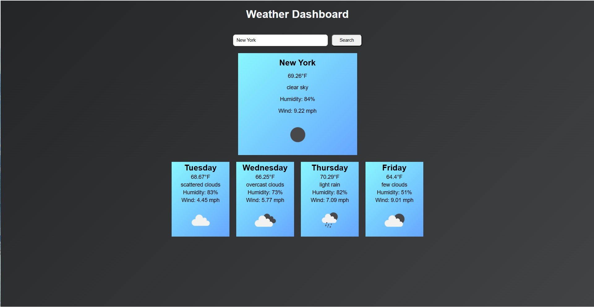

<div align="center">

# 🌦️ Weather Dashboard

A weather dashboard that lets users search for a city and view current weather conditions as well as a four-day forecast.


</div>

---

## 📚 Table of Contents

- [About the Project](#about-the-project)
  - [Screenshots](#screenshots)
- [Tech Stack](#tech-stack)
- [Environment Variables](#environment-variables)
- [Getting Started](#getting-started)
  - [Prerequisites](#prerequisites)
  - [Installation](#installation)
- [Usage](#usage)
- [API Reference](#api-reference)
- [Features](#features)
- [Future Improvements](#future-improvements)
- [Acknowledgements](#acknowledgements)
- [Author](#author)

---

## 📌 About the Project

Weather Dashboard is a frontend web application built with HTML, CSS, and JavaScript.

The app allows users to input a city, and data retrieved from the OpenWeather API will display the current weather, as well as the next four-day forecast.

### Screenshots



> Make sure `assets/demo.jpg` exists in the project folder. If the file name or path is different, update the image path above.

---

## 🛠️ Tech Stack

**Client:** HTML, CSS, JavaScript

**API:** OpenWeather API

**Tools:** VS Code, Live Server, Git, GitHub

---

## 🔐 Environment Variables

To run this project, you need an OpenWeather API key.

In `script.js`, replace:

```js
const API_KEY = "GENERATE AN API KEY FROM OPEN WEATHER IT'S FREE";
```

with your own API key.

Do not commit your real API key to GitHub.

---

## 🚀 Getting Started

Follow these steps to run the project locally.

### Prerequisites

You need:

- A web browser
- VS Code or another code editor
- A free OpenWeather API key
- Live Server extension, optional but recommended

### Installation

Clone the repository:

```bash
git clone YOUR_REPOSITORY_URL
```

> Replace `YOUR_REPOSITORY_URL` with your actual GitHub repository URL after creating the repo.

Move into the project folder:

```bash
cd "Weather Dashboard"
```

Open the project in VS Code:

```bash
code .
```

Add your OpenWeather API key inside `script.js`.

Then open `index.html` in your browser or start the project using Live Server.

---

## 💻 Usage

1. Enter a city name in the search box.
2. Click the **Search** button.
3. View the current weather card.
4. View the four-day forecast cards below.

Example searches:

```text
San Jose
New York
Los Angeles
Chicago
```

---

## 🌐 API Reference

This project uses the OpenWeather API.

### Current Weather Endpoint

```text
https://api.openweathermap.org/data/2.5/weather?q={CITY_NAME}&appid={API_KEY}&units=imperial
```

### Forecast Endpoint

```text
https://api.openweathermap.org/data/2.5/forecast?q={CITY_NAME}&appid={API_KEY}&units=imperial
```

---

## ✨ Features

- Search weather by city
- Display current temperature
- Display humidity and wind speed
- Display weather description
- Display weather icons
- Show a four-day forecast
- Format forecast dates into weekday names
- Handle invalid city searches
- Hide weather cards until data is loaded
- Centered layout using CSS Flexbox

---

## 🔮 Future Improvements

- Add Fahrenheit/Celsius toggle
- Add recent search history using localStorage
- Add loading animation while fetching data
- Improve mobile responsiveness
- Add dynamic background based on weather condition
- Add Enter key search support

---

## 🙏 Acknowledgements

- [OpenWeather](https://openweathermap.org/) for providing the weather API
- [Shields.io](https://shields.io/) for the README badges

---

## 👤 Author

Built by Amir Wanta.